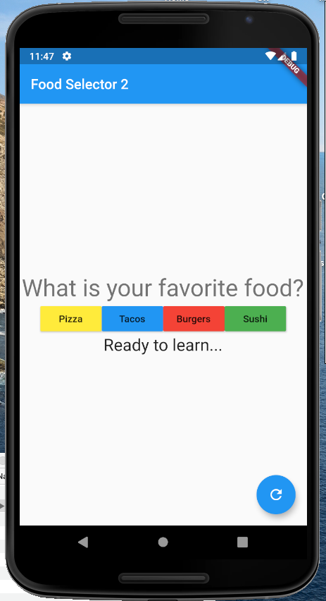

# Assignment 4: Food Selector 2

*Due: Thursday, October 1, 2020 ...extra time!*

This assignment requires you to build upon the app from the last workshop (Thursday, September 24) by adding widgets that meet the minimum requirements defined below.

## Requirements

- Add/change colors to at least three elements
- Center everything and change the alignment of the buttons 
- Change the font sizes of at least two elements

### Functional requirements

- Change all the text in all the widgets, from the AppBar, to the prompts, and buttons 
- In addition to styling changes, add one more food choice
- Add a Reset button that sets the answer back to it's original text
- When the Reset button is used, print "Reset" to the console

## Suggestions

- Work in Android Studio, not DartPad because Android Studio lets you collapse sections of code so you can focus on one area at a time.  
- Android Studio has a *Format* feature (like DartPad); it's under the menu **Code** | **Reformat Code**
- Keep the code from our previous demos, assignments, and workshops nearby.  Everything you need to do for this assignment has been done before.  You just need to understand the code well enough to know what to copy & paste (and then tweak) to make it work in this app
  - Note: the exact structure and implementation of the widgets in the previous apps may be different than the Food Selector, but still, you should be able to recognize the differences and work around them

Here is an example of the formatting and content changes, below.  You need to do something similar (and not exactly the same) as this example...

## Turn it in

- When your program works without error in your AVD in Android Studio, create a GitHub Gist for it
- Turn-in the *DartPad* URL of the Gist in the **Assignment 4: Food Selector Styles** in Blackboard. 