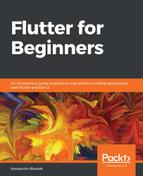

# Course Syllabus: Programming Digital Media

This course introduces core concepts and techniques of computer programming and mobile app development to prepare students for more advanced topics in creation, manipulation, storage and transmission of digital media. Students will develop an understanding of computer capabilities and the skills required of computer programmers. No previous programming experience is required. 

**Course Objectives:** at the conclusion of this course, students should be able to: 

- Demonstrate a proficiency in the Google Dart programming language

- Use Google Dart to manipulate text, images, audio, and video

- Synthesize the individual multi-media programming techniques into a cohesive product

- Identify the fundamental concepts of Google Dart in other, similar programming languages

## Course Section: **DMST 102-1 - Programming Digital Media**

- Meeting Pattern: **Tues/Thurs 2:00 PM - 3:15 PM EDT**
- Credits: **4.0**

*The course will be 100% online with some synchronous parts, and some asynchronous parts*

- Location: **Live Online Meetings (synchronous, Zoom + recordings in Panopto)**
  - As scheduled, students must attend meetings via Zoom to work on selected assignments in real-time
  - OR if unable to attend in real-time, watch recordings of the Zoom session in Panopto within 24 hours of being published on Tuesdays and Thursdays
- Location: **Online Lecture (asynchronous, Panopto)**
  - As scheduled, students must watch recorded lecture videos in Panopto within 24 hours of being published on Tuesdays and Thursdays

## Course Information and Announcements

- All **course documentation** and **assignments** for DMS 102 will be published here: **[docs.dms102.org](http://docs.dms102.org/)**, not in Blackboard.
- All **announcements** for DMS 102 will be distributed via "Slack" - an online communication and collaboration tool, not in Blackboard.

  - Students are required to **create a Slack account here**: [ join.slack.com/t/dms102/signup](https://join.slack.com/t/dms102/signup) and then monitor the DMS 102 Slack Workspace here: **[dms102.slack.com](https://dms102.slack.com/)** throughout the semester.
    - When registering for an account in Slack, students must use their **rochester.edu** email
    - Suggestion: after you setup your Slack account, instead of using Slack via the website, **install the device software**: [slack.com/downloads](https://slack.com/downloads)
- **Blackboard** will be used for students to turn-in assignments and monitor their grade progress throughout the semester.

## Instructor Information 

Instructor: **Professor Kostin** Instructional Faculty Digital Media Studies Program; Computer Science Department 206a Morey Hall (private office); 2105 Wegmans Hall (shared office)

- e-mail: **<robert.kostin@rochester.edu>** - not recommended due to excessive incoming messages, instead...
- For faster reply, please use [**Slack**](https://dms102.slack.com/) to contact the professor; send a **DM to Professor Kostin**
- For real-time discussions (**office hours**), schedule an appointment using [**Calendly**, an online scheduling app](https://calendly.com/rkostin) to setup a private Zoom meeting

The professor will be online to present assignments, provide suggestions, and answer questions via our **#help channel in Slack**, and via scheduled **Zoom** sessions.

- To learn about **assignments**, attend the scheduled Zoom sessions
- To get **technical help** in Slack, use the #help channel; the professor will answer
- To discuss **grades or private matters**, send a DM to the professor in Slack

## Textbook

Textbook (required) **Flutter for Beginners**

- Biessek, A. (2019)
- Packt Publishing
- ISBN-10: 1788996089, ISBN-13: 978-1788996082

Additional reading and videos will be posted as needed

## The Virtual Classroom Experience

Each scheduled class session will be of two types: (#1) lecture/demo and (#2) workshop. On lecture/demo days, the instructor will introduce new concepts and walk the students through a step-by-step application of them. Workshop days will begin with the instructor introducing the next assignment and then allowing time for supervised work on that assignment. 

Due to the hands-on nature of the class, comprehensive reading and active participation are not only vital to your grade, but also to your education. 

## Grading

For each assignment, a grading rubric will be provided. Rubrics will inform students how assignments are evaluated.  In the interest of fairness, extra credit and make-up work is not offered.  

### Grading Schema

| **Range**      | **Grade** |
| -------------- | --------- |
| 93.00 to 100   | A         |
| 90.00 to 92.99 | A-        |
| 87.00 to 89.99 | B+        |
| 84.00 to 86.99 | B         |
| 80.00 to 83.99 | B-        |
| 77.00 to 79.99 | C+        |
| 74.00 to 76.99 | C         |
| 70.00 to 73.99 | C-        |
| 67.00 to 69.99 | D+        |
| 64.00 to 66.99 | D         |
| 60.00 to 63.99 | D-        |
| 00.00 to 59.99 | E         |

| Activity                  | Weight of the final grade |
| ------------------------- | ------------------------- |
| Homework assignments (x8) | 40%                       |
| Projects (x3)             | 30%                       |
| Final Project             | 20%                       |
| Participation             | 10%                       |

## Late assignments

Homework assignments handed in after the deadline without appropriate excuse will receive reduced credit. The maximum possible score on late homework will decrease by 10% for each day late. 

- For example, an assignment which would receive a grade of 85% if handed in on time, would receive a grade of 85% x 90% = 76.5%
- If handed in the next day. The same assignment turned in three days late would receive a grade of 85% x 70% = 59.5%. 
- Following this system, homework handed in 10 or more days late cannot receive a grade higher than 0% and therefore will not be graded. 
- Exceptions to this policy may be made by the professor at the his discretion, in response to extenuating circumstances

## Academic Integrity

Any violation of academic integrity, such as, but not limited to, plagiarism, will not be tolerated. Anyone suspected of plagiarism will be subject to according disciplinary procedures. Plagiarism is the presenting of someone else’s writings or ideas as one’s own. Any ideas, wording, or material taken from another source must be acknowledged and properly documented. Failure to credit one’s sources constitutes an act of plagiarism, regardless of whether the act was done intentionally or unintentionally. 

## College Policy Concerning Students with Disabilities

The University of Rochester respects and welcomes students of all backgrounds and abilities. In the event you encounter any barrier(s) to full participation in this course due to the impact of a disability please contact the Office of Disability Resources. The access coordinators in the Office of Disability Resources can meet with you to discuss the barriers you are experiencing and explain the eligibility process for establishing academic accommodations. You can reach the Office of Disability Resources at: disability@rochester.edu; (585) 276-5075; Taylor Hall. 

##Incompletes

This course follows the [university policy](https://www.rochester.edu/college/ccas/handbook/incompletes.html) regarding incompletes. Incompletes may be given only when there are circumstances beyond the student's control, such as illness or personal emergency, that prevented the student from finishing the coursework on time.

## Absence Due to Illness

The University Health Service does not provide retroactive excuses for missed classes. However, upon request, UHS can provide documentation that the student (you) are (present tense) too ill to attend classes within a certain range of dates, without mention of specifics or the reason for the absence.  

Upon presenting the documentation to the professor, deadlines for assignments may be extended.

Students with extended or severe illness should contact the [College Center for Advising Services](http://www.rochester.edu/college/ccas/) for advice and assistance.

## Academic Support Services

- [College Center for Advising Services](http://www.rochester.edu/college/ccas/)
- [Office of Disability Resources](https://www.rochester.edu/college/disability/) *
- [Center for Excellence in Teaching and Learning (CETL)](https://www.rochester.edu/college/cetl/)
- [Writing, Speaking, and Argument Program](https://writing.rochester.edu/)

*** Disability Resources:** The University of Rochester respects and welcomes students of all backgrounds and abilities. In the event that you encounter any barrier(s) to full participation in this course due to the impact of disability, please contact the **Office of Disability Resources** at [disability@rochester.edu](mailto:disability@rochester.edu); (585) 276-5075; Taylor Hall.

## Schedule

This [schedule (linked here)](schedule.md) is subject to modification throughout the semester.  Always check with the professor to answer questions about the schedule.